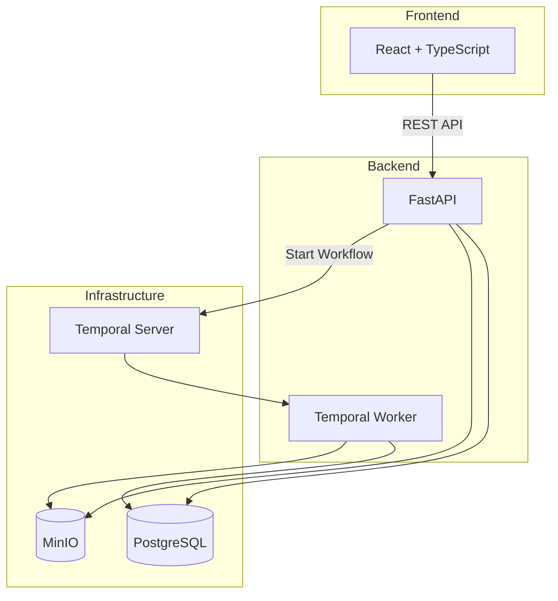

# Loom

[](https://github.com/jrwinget/loom/actions/workflows/ci.yml)

An evidence synthesis operating system. Loom helps combine multiple source
documents (e.g., video, photos, statements) into defensible event timelines
where every claim traces back to source material.

## Architecture



### Evidence Spine

The core data model is an evidence spine that traces every claim back to source
material:

```
Case
 ├── Assets (immutable originals + derivatives)
 │    ├── Chain of Custody (append-only audit trail)
 │    └── Metadata (ExifTool + PyAV extraction)
 ├── Annotations (observation, claim, dispute, verification)
 ├── Timeline Events
 │    └── Evidence Links (supports / contradicts / context)
 └── Export Bundles (verifiable packages with checksums)
```

### Tech Stack

| Layer          | Technology                     |
| -------------- | ------------------------------ |
| API            | FastAPI + Uvicorn              |
| Database       | PostgreSQL 16 + SQLAlchemy 2.0 |
| Object Storage | MinIO (S3-compatible, WORM)    |
| Workflows      | Temporal                       |
| Frontend       | Vite + React 18 + TypeScript   |
| UI Components  | shadcn/ui (Radix + Tailwind)   |
| State          | Zustand + TanStack Query       |
| Testing        | pytest, Vitest, Playwright     |

## Quick Start

### Prerequisites

- Python 3.12+
- Node.js 22+
- Docker and Docker Compose
- [uv](https://docs.astral.sh/uv/) (Python package manager)
- [pnpm](https://pnpm.io/) (Node package manager)

### Setup

```bash
# clone the repository
git clone https://github.com/jrwinget/loom.git
cd loom

# copy environment config
cp .env.example .env

# start infrastructure services
make up

# install backend dependencies
cd backend && uv sync --all-extras && cd ..

# install frontend dependencies
cd frontend && pnpm install && cd ..

# run database migrations
make migrate

# start development servers
make dev
```

The API will be available at `http://localhost:8000/docs` and the frontend at
`http://localhost:3000`.

### Running Tests

```bash
make test           # all tests
make test-backend   # backend only
make test-frontend  # frontend only
make lint           # all linters
```

## Core Principles

1. **Originals are sacred**: the system preserves original files, filenames,
   order, and hashes with WORM-style immutability. Every access is logged.

2. **AI assists, humans decide**: AI can suggest transcripts, scene boundaries,
   and candidate events, but it never silently collapses ambiguity into false
   certainty. Contradictions are surfaced, not hidden.

3. **Scale on ugly reality**: designed for terabytes of mixed footage with
   resumable upload, batch ingest, async processing, and proxy-based review.

4. **No surveillance features**: face recognition, suspicion scoring, and
   automated identity resolution are explicitly out of scope.

## Key Features

- **Authenticated routes**: all non-public routes require JWT authentication
  with automatic redirect to login
- **Configurable CORS**: production deployments use `LOOM_CORS_ORIGINS` instead
  of blocking all cross-origin requests
- **Async workflow pipelines**: ingest, export, transcription, OCR, and scene
  detection run as Temporal workflows with proper error propagation (502 on
  workflow service failure)
- **Complete database schema**: all models have corresponding Alembic migrations
  including redactions and revoked tokens tables
- **Referential integrity**: all foreign keys include explicit `ondelete`
  constraints matching migration definitions
- **Type-safe API layer**: response schemas are constructed explicitly from model
  fields with no suppressed type errors
- **User-facing error feedback**: all mutation hooks include `onError` toast
  notifications
- **Production-ready Docker**: pinned image versions, health checks on all
  containers, hardened backup/restore scripts
- **Operational runbook**: documented procedures for service restarts, disk
  management, debugging workflows, and emergency response

## Project Structure

```
loom/
├── backend/          # FastAPI + SQLAlchemy + Temporal
│   ├── src/loom/     # application code
│   ├── tests/        # pytest test suite
│   └── alembic/      # database migrations (001-003)
├── frontend/         # Vite + React + TypeScript
│   ├── src/          # application code
│   └── tests/        # vitest test suite
├── docker/           # docker compose services
├── docs/             # project documentation
│   ├── runbook.md    # operational runbook
│   └── ...           # architecture, security, deployment, API
└── Makefile          # unified dev commands
```

## Documentation

- [Architecture](docs/architecture.md) — system design and data model
- [API Reference](docs/api-reference.md) — REST endpoint documentation
- [Security](docs/security.md) — auth, RBAC, CSRF, rate limiting
- [Deployment](docs/deployment.md) — production deployment guide
- [Backup & Recovery](docs/backup-recovery.md) — backup procedures
- [Operational Runbook](docs/runbook.md) — day-to-day operations
- [Contributing](docs/contributing.md) — development setup and PR process

## License

[MIT](LICENSE)
