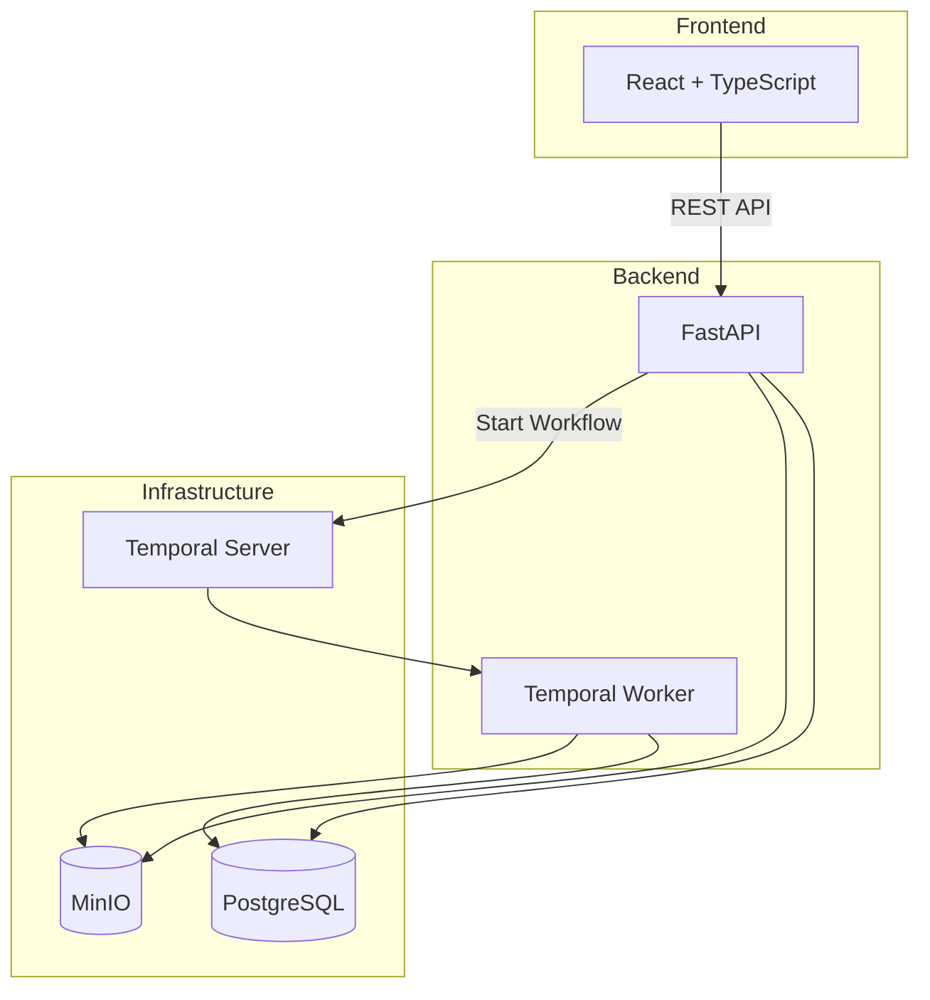

# Loom

[](https://github.com/jrwinget/loom/actions/workflows/ci.yml)

An evidence operating system for the
[National Lawyers Guild](https://www.nlg.org/). Loom helps
combine multiple source documents — video, photos, statements
— into defensible event timelines where every claim traces
back to source material.

## Architecture



### Evidence Spine

The core data model is an evidence spine that traces every
claim back to source material:

```
Case
 ├── Assets (immutable originals + derivatives)
 │    ├── Chain of Custody (append-only audit trail)
 │    └── Metadata (ExifTool + PyAV extraction)
 ├── Annotations (observation, claim, dispute, verification)
 ├── Timeline Events
 │    └── Evidence Links (supports / contradicts / context)
 └── Export Bundles (verifiable packages with checksums)
```

### Tech Stack

| Layer | Technology |
|-------|-----------|
| API | FastAPI + Uvicorn |
| Database | PostgreSQL 16 + SQLAlchemy 2.0 |
| Object Storage | MinIO (S3-compatible, WORM) |
| Workflows | Temporal |
| Frontend | Vite + React 18 + TypeScript |
| UI Components | shadcn/ui (Radix + Tailwind) |
| State | Zustand + TanStack Query |
| Testing | pytest, Vitest, Playwright |

## Quick Start

### Prerequisites

- Python 3.12+
- Node.js 20+
- Docker and Docker Compose
- [uv](https://docs.astral.sh/uv/) (Python package manager)
- [pnpm](https://pnpm.io/) (Node package manager)

### Setup

```bash
# clone the repository
git clone https://github.com/jrwinget/loom.git
cd loom

# copy environment config
cp .env.example .env

# start infrastructure services
make up

# install backend dependencies
cd backend && uv sync --all-extras && cd ..

# install frontend dependencies
cd frontend && pnpm install && cd ..

# run database migrations
make migrate

# start development servers
make dev
```

The API will be available at `http://localhost:8000/docs`
and the frontend at `http://localhost:3000`.

### Running Tests

```bash
make test           # all tests
make test-backend   # backend only
make test-frontend  # frontend only
make lint           # all linters
```

## Core Principles

1. **Originals are sacred** — the system preserves original
   files, filenames, order, and hashes with WORM-style
   immutability. Every access is logged.

2. **AI assists, humans decide** — AI can suggest transcripts,
   scene boundaries, and candidate events, but it never
   silently collapses ambiguity into false certainty.
   Contradictions are surfaced, not hidden.

3. **Scale on ugly reality** — designed for terabytes of mixed
   footage with resumable upload, batch ingest, async
   processing, and proxy-based review.

4. **No surveillance features** — face recognition, suspicion
   scoring, and automated identity resolution are explicitly
   out of scope.

## Project Structure

```
loom/
├── backend/          # FastAPI + SQLAlchemy + Temporal
│   ├── src/loom/     # application code
│   ├── tests/        # pytest test suite
│   └── alembic/      # database migrations
├── frontend/         # Vite + React + TypeScript
│   ├── src/          # application code
│   └── tests/        # vitest + playwright
├── docker/           # docker compose services
├── docs/             # project documentation
└── Makefile          # unified dev commands
```

## Phased Roadmap

- **Phase 1** (current): Immutable ingest, chain of custody,
  metadata extraction, proxy generation, case workspace,
  manual timeline/annotation, export bundles
- **Phase 2**: Transcription (faster-whisper), OCR (Tesseract),
  scene detection (PySceneDetect), full-text search, duplicate
  clustering
- **Phase 3**: Cross-source event clustering, contradiction
  surfacing, map/time alignment, report drafting
- **Phase 4**: C2PA provenance packaging, multi-chapter
  collaboration, plugin architecture

## Contributing

See [docs/contributing.md](docs/contributing.md) for
development setup, coding standards, and PR process.

## Security

See [docs/security.md](docs/security.md) for the security
model, threat assumptions, and responsible disclosure process.

## License

[MIT](LICENSE)
